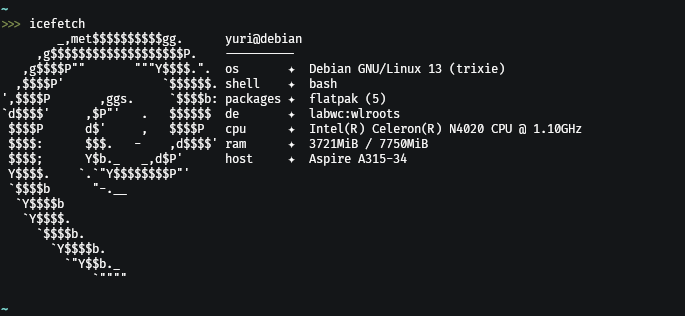

#  icefetch
the #1 linux fetch backend! really really fast, easily customizable and lightweight. some features below.

# 

<h2>really fast</h2>
icefetch uses golang, which is an extremely fast language but still easy to use. this makes the update times really short, whereas the app remains light and fast 

<h2>extremely modular</h2>
everything can be modified easily. icefetch uses toml, which is a comprehensive config file format, and also placeholders for the config modules

<h2>still in development</h2>
icefetch is still in alpha, so any kind of feedback helps a lot with the development.

# installation
the easiest way to install icefetch is by cloning the repository and running "install.sh". note that this will not be validated by any package manager.

1. install the dependecies (go)
```
sudo apt install golang-go
(or)
sudo pacman -S go
(or)
sudo dnf install golang
```

2. clone the repository and cd into it:
```
git clone https://github.com/yrod0200/icefetch
cd icefetch
```
3. run the install.sh script
```
sh ./install.sh
```

the program will be built and installed on your system. enjoy!

<strong>the support for various distro packages will be brought soon.</strong>


# Configuration

the wiki will be made soon. in the meantime, the default icefetch.toml should give you the info needed for ricing your own fetch.


